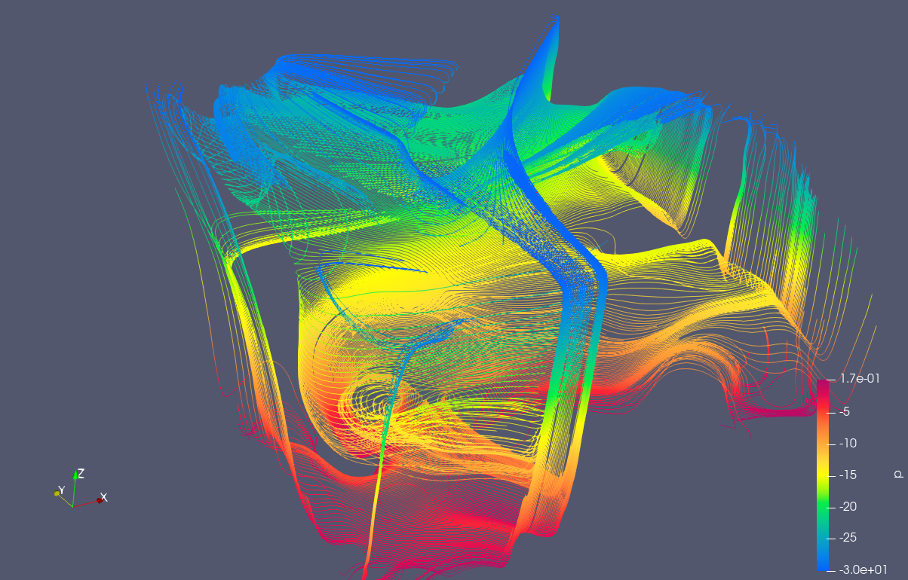

# CFD Radiator Placement Study

This project investigates the influence of radiator placement on indoor airflow and temperature distribution using computational fluid dynamics (CFD) simulations in OpenFOAM.

---

## Objective

The objective of this study is to evaluate how different radiator positions affect:

- Temperature distribution within a closed room  
- Airflow structure and natural convection patterns  
- Thermal mixing and circulation behavior  

---

## Geometry and Model Setup

A simplified indoor environment was modeled with the following characteristics:

- Room dimensions: **5 m × 5 m × 2.5 m**  
- Geometry created in **SolidWorks**  
- Fluid domain representing indoor air  

---

## Numerical Model

- Solver: **buoyantSimpleFoam** (steady-state)  
- Flow type: incompressible, buoyancy-driven flow  
- Density treatment: **Boussinesq approximation**  
- Turbulence model: **k-ε**  

---

## Mesh Generation

The computational mesh was generated in two steps:

- A structured base mesh was created using **blockMesh**  
- Geometry adaptation and refinement were performed using **snappyHexMesh**  

---

## Boundary Conditions

Thermal boundary conditions were defined using a convective heat transfer model:

- Ambient temperature: **288 K**  
- Heat transfer coefficients:  
  - Walls: **2 W/(m²K)** (well insulated surfaces)  
  - Windows: **10 W/(m²K)** (higher heat loss)  

The radiator acts as a heat source driving natural convection within the room.

---

## Results and Discussion

The simulations indicate that radiator placement has only a minor influence on the **average room temperature**, with a maximum deviation below **0.2 K**.

However, significant differences in **flow structures and circulation patterns** were observed.

These findings suggest that radiator placement primarily affects **airflow and mixing behavior**, rather than overall temperature levels.

---

## Flow Structure

Example of airflow structure using streamlines:

  

---

## Reproducibility

The simulation can be reproduced using:

cd case
chmod +x Allrun
./Allrun

## Project Structure

CFD-Radiator-Study/
├── case/        OpenFOAM simulation setup  
├── results/     Post-processing visualizations  
├── report/      Detailed project report  
└── README.md  

## Report

A detailed description of methodology, assumptions, and results is available in:

report/CFD_Radiator_Study.pdf

## Author

Florian Fischer

## Remarks

This project was developed as part of a self-driven CFD learning process and focuses on:

Natural convection modeling
OpenFOAM case setup and workflow
Interpretation of simulation results

